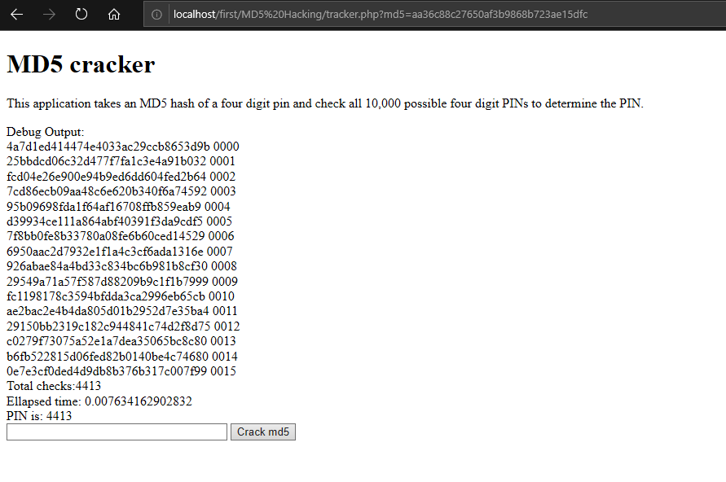
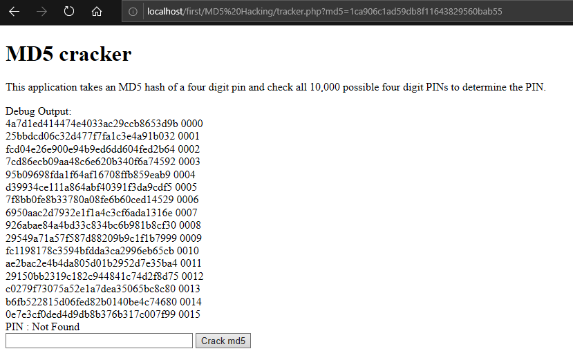

# MD5Cracking
This was made as a part of php course in coursera.In this assignment, I built code to reverse an MD5 hash using a brute force technique where we simply 'forward hash' all possible combinations of characters in strings. This would be similar to a situation where an e-commerce site stored hashed passwords in its database and we somehow have gotten our hands on the database contents and we want to take the hashed password and determine the actual plaintext passwords.

The simplest brute force approach generally is done by writing a series of nested loops that go through all possible combinations of characters. This is one of the reasons that password policies specify that you include uppper case, lower case, numbers, and punctuation in passwords is to make brute force cracking more difficult. Significantly increasing the length of the password to something like 20-30 characters is a very good to make brute force cracking more difficult.

This application takes an MD5 value like "81dc9bdb52d04dc20036dbd8313ed055" (the MD5 for the string "1234") and checks all combinations of four-digit "PIN" numbers to see if any of those PINs produce the given hash.

User fills a form where they enter an MD5 string and request to reverse-hash the string. 
If its reverse hash the string, it prints out :
```
PIN: 1234
```
If the string does not reverse hash to a four digit number it prints message:
```
PIN: Not found
```
I checked all four-digit combinations. The value was as a string not as an integer.
For this shows the right and wrong way to check the has for "1234":
```
$check = hash('md5', '1234'); // Correct - hashing a string
$check = hash('md5', 1234); // Incorrect - hashing an integer
```
It also prints out the first 15 attempts to reverse-hash including both the MD5 value and PIN that it was testing.It also prints out the elapsed time for your computation.

This code works for all hash_pins
Given this data,I had to find all pins except one.
| email	           | pin | hash_pin                      |
|------------------|-----|-------------------------------|
|csev@umich.edu	   |???? |0bd65e799153554726820ca639514029|
|nabgilby@umich.edu|???? |aa36c88c27650af3b9868b723ae15dfc|
|pconway@umich.edu |???? |1ca906c1ad59db8f11643829560bab55|
|font@umich.edu	   |???? |1d8d70dddf147d2d92a634817f01b239|
|collemc@umich.edu |???? |acf06cdd9c744f969958e1f085554c8b|

 
 
